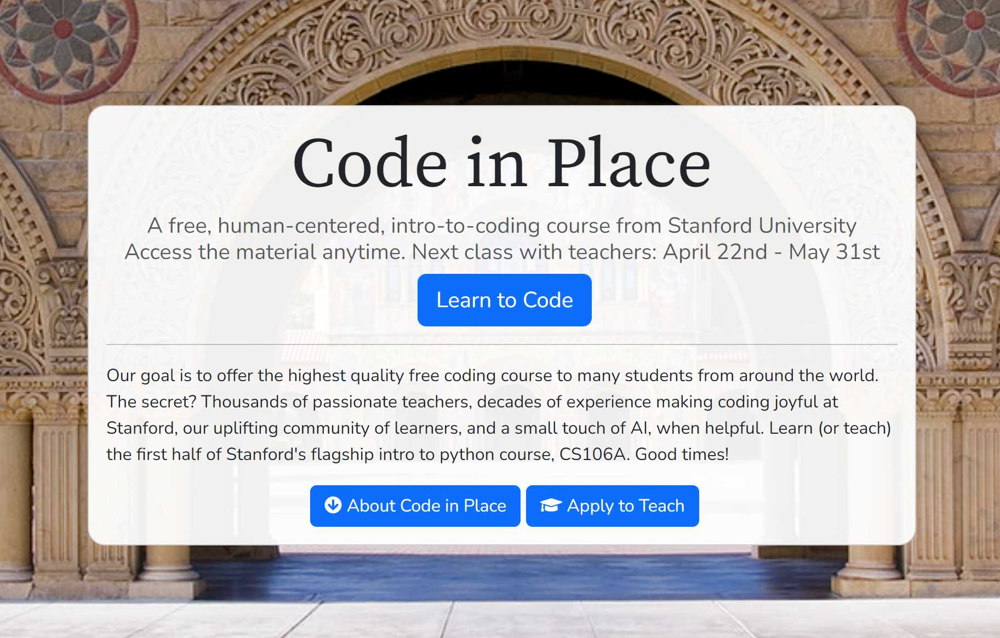

# Stanford CS106A - Code in Place 2024

    

## About Code in Place

Stanford University's "Code in Place" program is an international computer science Python course offered for free across the world.  In the 2024 version of the course, the program had 700 volunteer teachers and 10,000 students.

Code in Place is the online version of Stanford's CS106A course ("Programming Methodology"), the university's largest and most popular programming course with enrollment of 1,300+ students per year.

Course website: 
 
https://codeinplace.stanford.edu/

YouTube intro video: 
  
https://www.youtube.com/watch?v=wg3Dl4yQSMU

Forbes article:
 
https://www.forbes.com/sites/michaeltnietzel/2023/06/01/stanford-universitys-free-code-in-place-course-hits-the-mark/amp/

## Section Slides

I am a Section Leader for Code in Place 2024, leading a weekly section of students over Zoom.  The course lasts 6 weeks and covers many topics in computer science and Python.  In the live sections, we go over new concepts and work through hands-on exercises.

I created the slides in this repository for use in my weekly sections.

## Schedule

- Week 1 - Karel, Control Flow
- Week 2 - Art of Problem Solving, Decomposition
- Week 3 - Introduction to Python, Expressions
- Week 4 - Python Control Flow
- Week 5 - Graphics, Functions
- Week 6 - Lists, Dictionaries
- Beyond - Final Project